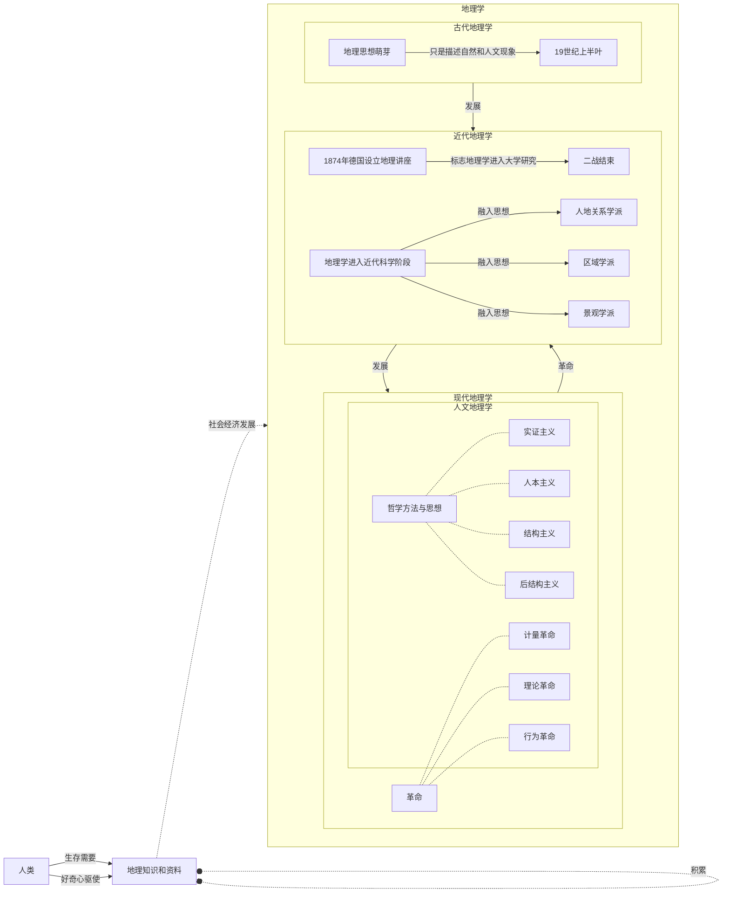
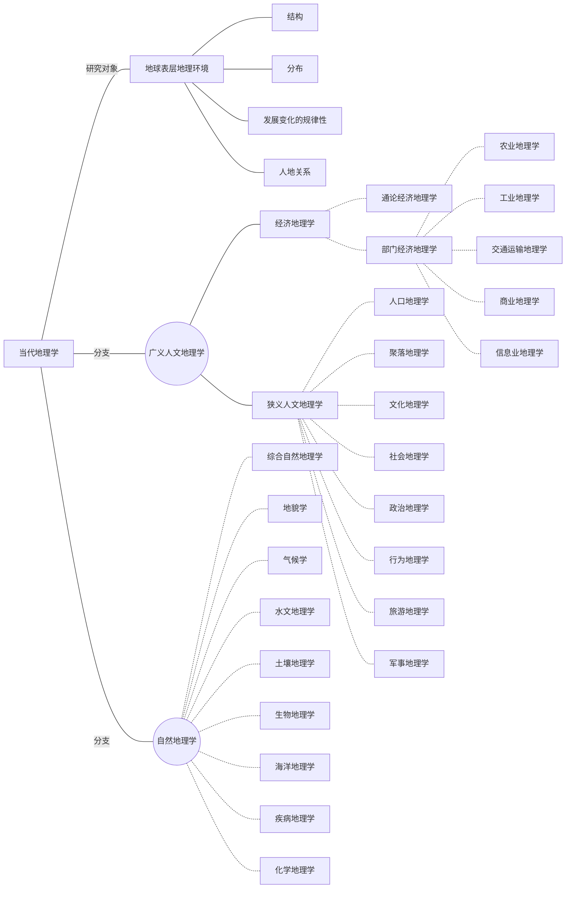

# Human Geography Notes

## 0 课前准备

### 教材特点

#### 撰写原则

1. 重点：人文地理学的系统性和完整性
2. 中心：人地关系
3. 框架：以文化为中心的人地关系

#### 5大部分

1. 基础理论部分｜第1～3章

2. 核心：人及相关文化特征｜第4章

3. 工农业物质文明与城市景观｜第5～7章

4. 人类非物质文明的地理表现｜第8～12章

   1. 语言

   2. 宗教

   3. 旅游

   4. 政治

   5. 人类行为

      > 这个人类行为单独列为一章是为什么？
      >
      > 难道旅游、政治这些不是人类行为？

5. 人文地理学所面临的重要问题｜第13章

### 课程概述

### 教学目标

## 1 绪论

### 1.1 人文地理学的研究对象和特性

#### 1.1.1 地理学与人文地理学

##### 地理学的发展历程

##### 当代地理学

> 这也说明，人地关系是在地理学中普遍研究的，不光是在人文地理学有研究。

#### 1.1.2 人文地理学的研究对象

#### 1.1.3 人文地理学的学科特性

### 1.2 西方人文地理学的发展过程

### 1.3 中国人文地理学的发展

### 1.4 人文地理学的研究任务

## 2 人文地理学的研究主题与基本理论

### 2.1 人文地理学研究的主题

### 2.2 人文地理学的基本理论

## 3 人文地理学的主要研究方法

### 3.1 人文地理学研究的一般程序

### 3.2 人文地理学研究的方法论

### 3.3 人文地理学的主要研究方法

## 4 人口、人种和民族 

### 4.1 人口与发展

### 4.2 人口分布与迁移

### 4.3 人种

### 4.4 民族

### 4.5 民俗与流行文化

## 5 农业的起源与发展

### 5.1 农业的起源

### 5.2 农业的发展与类型

### 5.3 世界农业生产布局

### 5.4 农业景观和农业区位论

## 6 工业的出现与工业区位

### 6.1 工业的出现和发展

### 6.2 产业类型及其分布

### 6.3 影响工业分布的因素及其新变化

## 7 聚落与城市化

### 7.1 聚落起源与发展

### 7.2 城市化及动力机制

### 7.3 城市与城市地域结构

### 7.4 城市体系与城市景观

## 8 语言类型与语言景观

### 8.1 语言的起源与发展

### 8.2 世界语言分类与分布

### 8.3 语言的传播与影响

### 8.4 语言景观

## 9 宗教地理与宗教景观

### 9.1 宗教的产生与世界主要宗教

### 9.2 宗教的传播与分布

### 9.3 宗教仪礼、习俗与地理环境

### 9.4 宗教景观

## 10 旅游地理

### 10.1 旅游业的兴起与发展

### 10.2 旅游者与旅游客源地与目的地

### 10.3 旅游地的文化特征

### 10.4 世界旅游资源和旅游地理

### 10.5 旅游开发的区域影响

## 11 政治与全球政治地理格局

### 11.1 政治与政治地理

### 11.2 国家政治地理特征

### 11.3 国家权力

### 11.4 全球政治地理格局

## 12 人类行为与行为空间

### 12.1 人类行为与地理环境

### 12.2 人类活动的行为空间

### 12.3 人类行为与区域选择模型

## 13 人文地理学所面临的问题

### 13.1 人口的迅速增长与可持续发展

### 13.2 世界政治多极化与经济一体化

### 13.3 全球化与本土化

